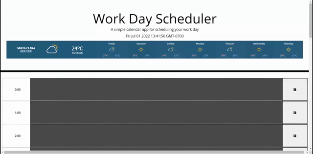

# Work Day Scheduler

 

<h3 align="center">Work Day Scheduler</h3>

  

    Browser-based scheduler
     
  

  
Table of Contents

  <ol>
    <li>
      <a href="#about-the-project">About The Project</a>
      <ul>
        <li><a href="#tools-used">Tools used</a></li>
      </ul>
    </li>
    <li>
      <a href="#instructions">Instructions</a>
        </li>
    <li><a href="#license">License</a></li>
    <li><a href="#contact">Contact</a></li>
  </ol>

## About The Project

The goal of this project was to make a user friendly, task manager that can be used to maintain a professional's daily schedule as well as details a weekly weather forcast to assist with any activity planning.  

(<a href="#top">back to top</a>)

### Tools used

* JavaScript
* CSS
* HTML

(<a href="#top">back to top</a>)

## Instructions

Once you have navagated to the webpage: 

- You are presented with the current date, time and weather for the upcoming week.
- You are able to navagate down to the corresponding hour block within the day and schedule events.   
- Once you click the save icon, any events are saved within your local storage which will be retrieved each time the page loads.

(<a href="#top">back to top</a>)

## License

Distributed under the MIT License. See `LICENSE.txt` for more information.

(<a href="#top">back to top</a>)

## Contact

Henry Nguyen -  hln11244@gmail.com

Project Link: [https://github.com/henry11244/WorkDayScheduler](https://github.com/henry11244/WorkDayScheduler)

(<a href="#top">back to top</a>)

[linkedin-url]: https://www.linkedin.com/in/henry11244/
